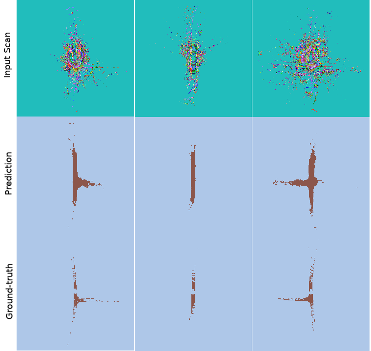

# MapLiteSeg

PyTorch (v1.0.0) re-implementation of [*ENet: A Deep Neural Network Architecture for Real-Time Semantic Segmentation*](https://arxiv.org/abs/1606.02147), ported from the excellent PyTorch impelentation [MapLiteSeg](https://github.com/davidtvs/PyTorch-ENet), which was in-turn ported from the lua-torch implementation [ENet-training](https://github.com/e-lab/ENet-training) created by the authors.

This implementation has been tailored to suit _MapLite_ LiDAR data.

<p align="center">
     
</p>


## What's great about ENet

On an NVIDIA GeForce GTX 1060, `ENet` operates at a rate of about 80 Hz! Should run faster on a better GPU.


## Installation

1. Python 3 and pip.
2. Set up a virtual environment (recommended).
3. Install dependencies using pip: ``pip install -r requirements.txt``.


## Usage

Run [``main.py``](https://github.com/krrish94/MapLiteSeg/blob/master/main.py), the main script file used for training and/or testing the model. The code has a lot of options. Make sure to read through most of them, before training/testing.

```
usage: main.py [-h] [--mode {train,test,inference,full}] [--resume]
               [--generate-images] [--arch {rgb,rgbd}]
               [--seg-classes {nyu40,scannet20}] [--batch-size BATCH_SIZE]
               [--epochs EPOCHS] [--learning-rate LEARNING_RATE]
               [--beta0 BETA0] [--beta1 BETA1] [--lr-decay LR_DECAY]
               [--lr-decay-epochs LR_DECAY_EPOCHS]
               [--weight-decay WEIGHT_DECAY] [--dataset {scannet}]
               [--dataset-dir DATASET_DIR] [--trainFile TRAINFILE]
               [--valFile VALFILE] [--testFile TESTFILE] [--height HEIGHT]
               [--width WIDTH] [--weighing {enet,mfb,none}]
               [--class-weights-file CLASS_WEIGHTS_FILE] [--with-unlabeled]
               [--workers WORKERS] [--print-step PRINT_STEP] [--imshow-batch]
               [--device DEVICE] [--name NAME] [--save-dir SAVE_DIR]
               [--validate-every VALIDATE_EVERY]
```

For help on the optional arguments run: ``python main.py -h``


### Examples: Training

```
python main.py -b 4 --epochs 50 --dataset-dir /path/to/prepared/data --trainFile cache/train.txt  --valFile cache/test.txt --testFile cache/test.txt --class-weights-file cache/class_weights_maplite.txt --print-step 25  --name ENet --lr-decay-epochs 60 -lr 1e-3 --beta0 0.7 --validate-every 3
```

Training for 10 epochs on 500 scans should take about **5-6 minutes** on an NVIDIA GeForce GTX 1060.


### Examples: Resuming training

```
python main.py -b 4 --epochs 50 --dataset-dir /path/to/prepared/data --trainFile cache/train.txt  --valFile cache/test.txt --testFile cache/test.txt --class-weights-file cache/class_weights_maplite.txt --print-step 25  --name ENet --lr-decay-epochs 60 -lr 1e-3 --beta0 0.7 --validate-every 3 --resume
```


### Examples: Inference

Once you're all trained and set, you can use `inference.py` to generate the cool-looking qualitative results on top of this `README`. A sample `inference.py` call would look like

```
python inference.py --mode inference -b  --epochs 1 --dataset-dir /path/to/prepared/data --trainFile cache/train.txt --valFile cache/val.txt --testFile cache/test.txt --print-step 1 --class-weights-file cache/class_weights_maplite.txt --name ENet --generate-images
```

This will create a directory named `ENetDepth_images` in the `save` directory.


## Project structure

### Folders

- [``data``](https://github.com/krrish94/MapLiteSeg/tree/master/data): Contains instructions on how to download the datasets and the code that handles data loading.
- [``metric``](https://github.com/krrish94/MapLiteSeg/tree/master/metric): Evaluation-related metrics.
- [``models``](https://github.com/krrish94/MapLiteSeg/tree/master/models): ENet model definition.
- [``save``](https://github.com/krrish94/MapLiteSeg/tree/master/save): By default, ``main.py`` will save models in this folder. The pre-trained models can also be found here.

### Files

- [``args.py``](https://github.com/krrish94/MapLiteSeg/blob/master/args.py): Contains all command-line options.
- [``main.py``](https://github.com/krrish94/MapLiteSeg/blob/master/main.py): Main script file used for training and/or testing the model.
- [``test.py``](https://github.com/krrish94/MapLiteSeg/blob/master/test.py): Defines the ``Test`` class which is responsible for testing the model.
- [``train.py``](https://github.com/krrish94/MapLiteSeg/blob/master/train.py): Defines the ``Train`` class which is responsible for training the model.
- [``transforms.py``](https://github.com/krrish94/MapLiteSeg/blob/master/transforms.py): Defines image transformations to convert an RGB image encoding classes to a ``torch.LongTensor`` and vice versa.
